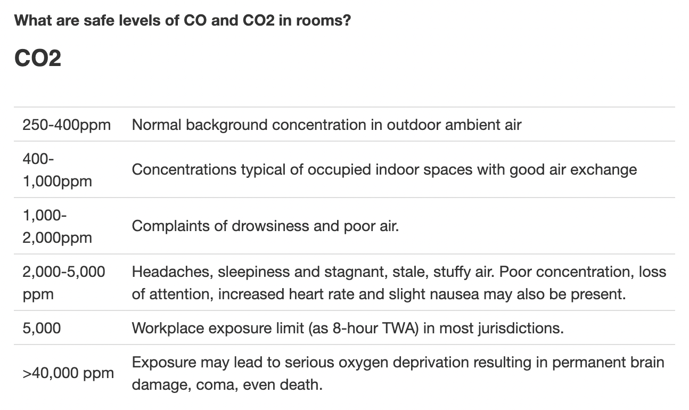
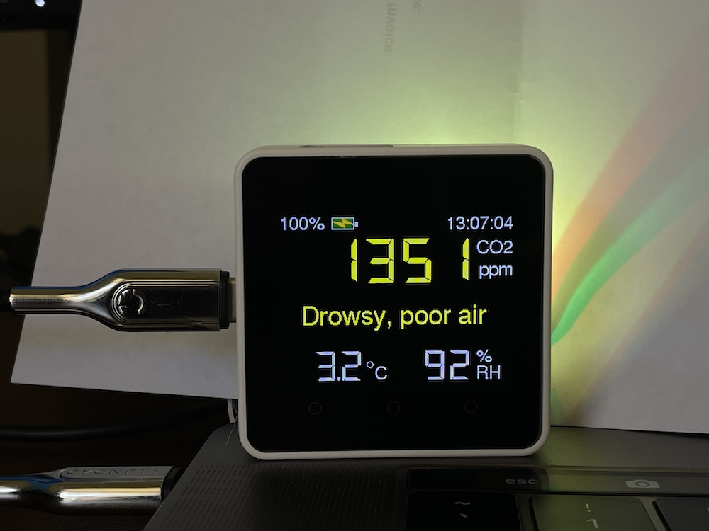
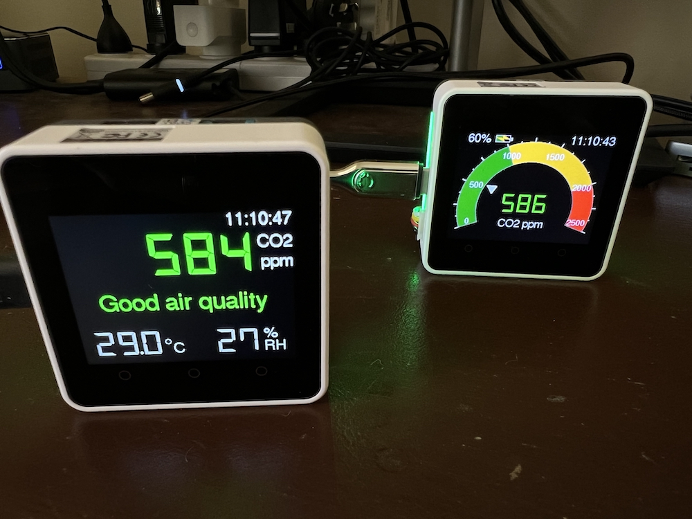
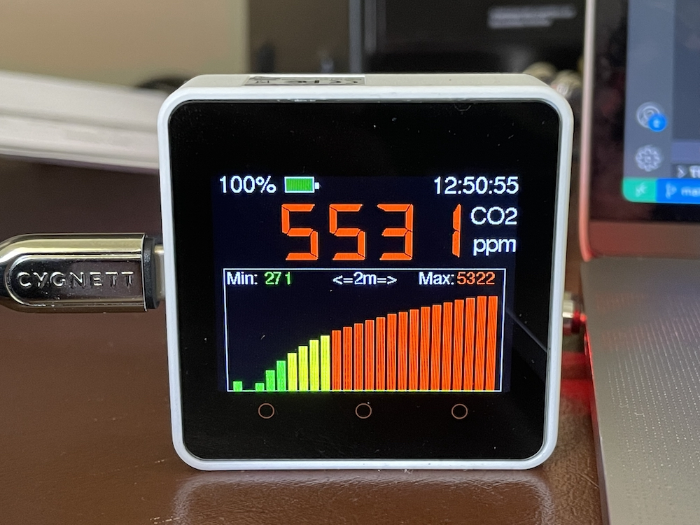
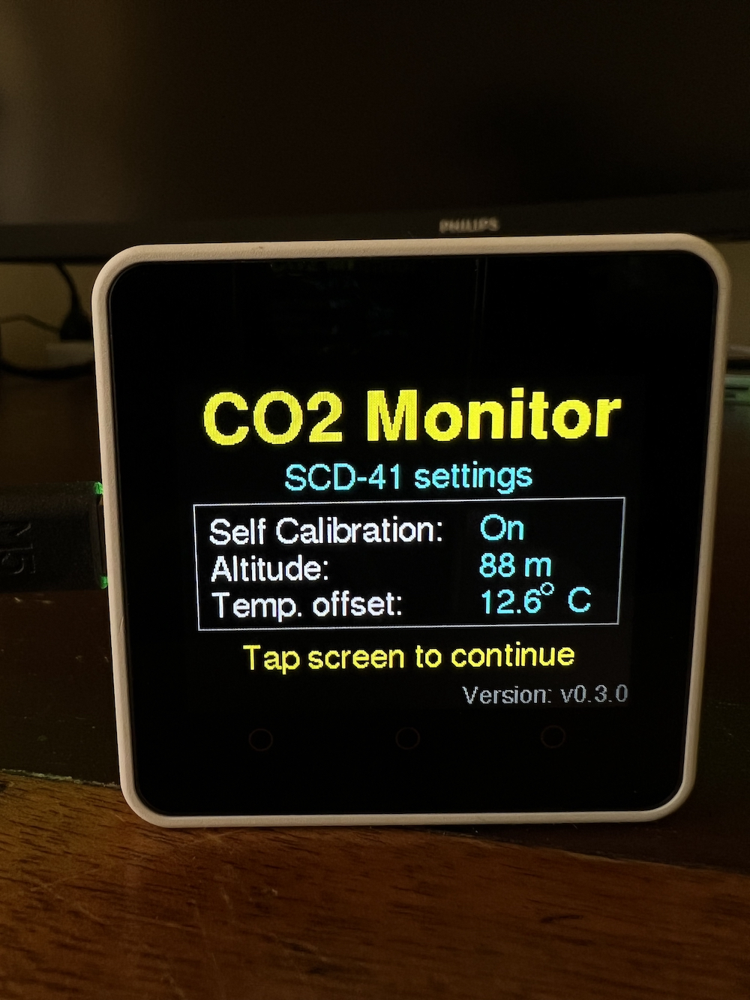
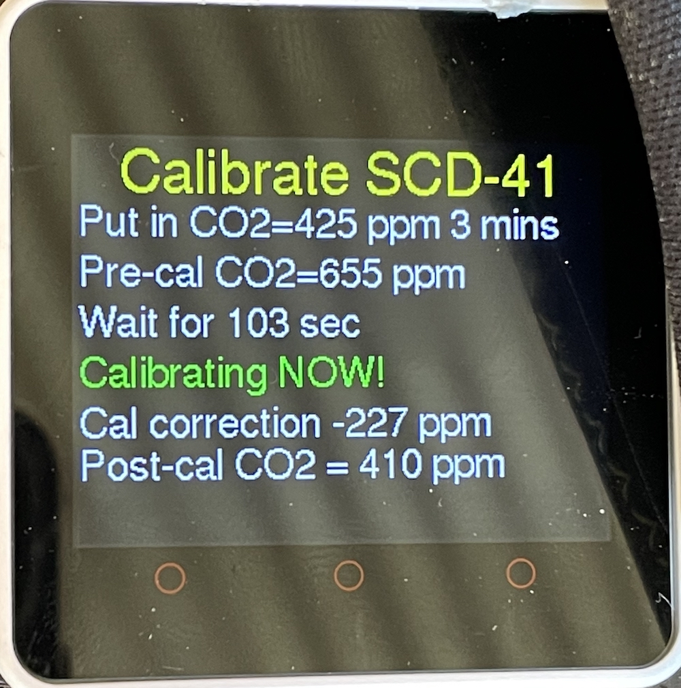
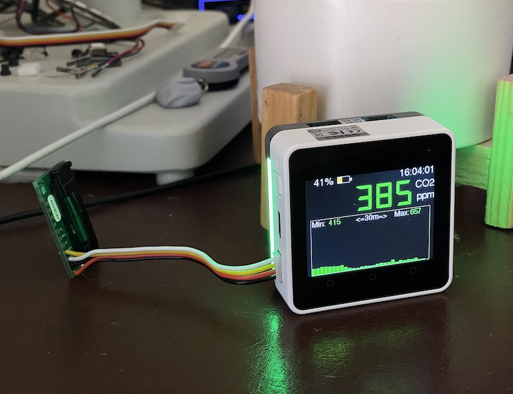
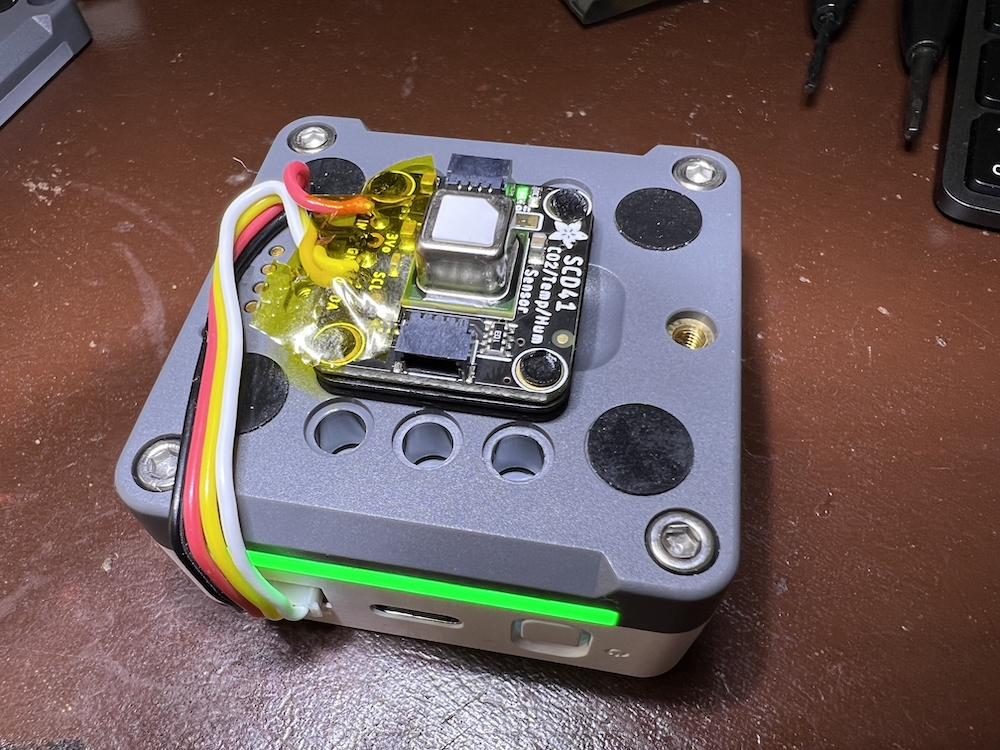
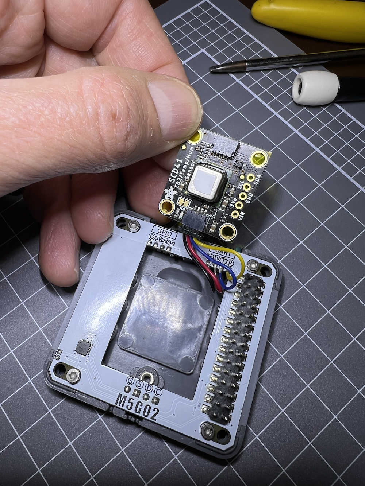
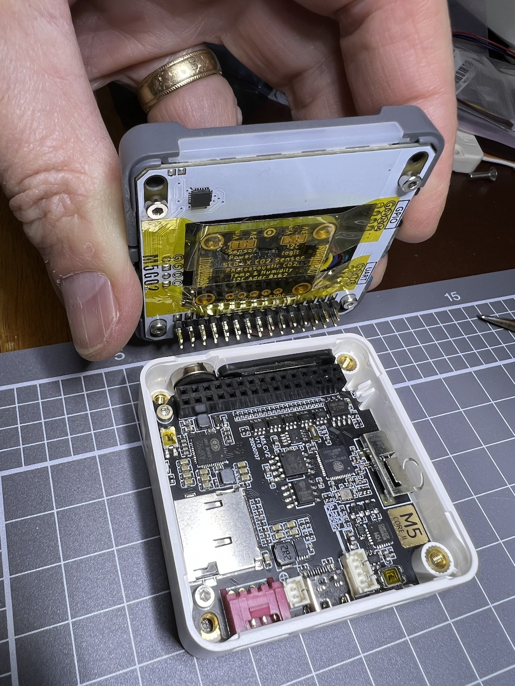

# CO2 Monitor enhanced
CO2 monitor that works with three different sensors, [SCD-30](https://au.mouser.com/ProductDetail/Sensirion/SCD30?qs=sGAEpiMZZMv0NwlthflBi416OFlovbRC0nuIF%252BcSLo4%3D), [SCD-41](https://www.adafruit.com/product/5190) and [SGP-30](https://www.adafruit.com/product/3709). I call it enhanced as compared to the prototype which only worked with the SCD-30, the code is structured as generic display code, and separate code for one of three different CO2 sensors, selected before compile.

---

## Background
  The project was inspired by some news stories and scientific papers stating that indoor CO2 levels can be used as a proxy for Covid19 infection risk indoors because when CO2 levels are high, it indicates a lack of ventilation and build up of people's breath which may contain virus particles or aerosols.
 
 Also high CO2 levels have negative effects on people too as described here [What are safe levels of CO2 in rooms?](https://www.kane.co.uk/knowledge-centre/what-are-safe-levels-of-co-and-co2-in-rooms)



---
## Software and hardware
 Programmed with Arduino C++ on an [M5Stack Core2](https://shop.m5stack.com/collections/stack-series/products/m5stack-core2-esp32-iot-development-kit?variant=35960244109476) with ESP32 microcontroller. The development IDE is PlatformIO. Sensor type is selected pre-compile using #define "SENSOR_IS_XXXXX" where XXXXX is the sensor type. #defines are in file ["platformio.ini"](platformio.ini) file, e.g. "-D SENSOR_IS_SCD41". To make it easier to switch between sensors, I created three PlatformIO "environments", just select the one with the sensor you want, e.g. "[env:SCD41_Internal]" recompile and flash the ESP32. The environments are defined in "platformio.ini" and also contain the sensor I2C SCL and SDA pins, as well as the upload and monitor port details.

```ini
; ---------------------------------------------------
; M5Stack Core2 with Sensirion SCD-41 mounted inside a base 2, I2C connected to black port, SDA=14, SCL=13
; ---------------------------------------------------
[env:SCD41_Internal]
upload_port = /dev/cu.wchusbserial5319013301
monitor_port = /dev/cu.wchusbserial5319013301
upload_speed = 921600 ; Other upload baud rates: 115200, 230400, 460800, 921600 or 1500000
build_flags = 
${env.build_flags}
-D SENSOR_IS_SCD41
-D CO2_SDA_PIN=14
-D CO2_SCL_PIN=13
```

The ESP32 is WiFi enabled and there is a button to push to get the time from the internet (via NTP) and set the ESP32's interal Real Time Clock (RTC).

I bought a [M5Stack battery bottom](https://shop.m5stack.com/products/m5go-battery-bottom2-for-core2-only) which screws on to the base of the Core2 module and has 10 RGB LEDs (5 on each side) as well as a LiPo battery and additional I2C and UART ports. The RGB LEDs change colour to so that the CO2 range can be quickly seen from the other side of the room:

```
CO2: < 1000     =   GREEN

CO2: 1000-2000  =   YELLOW

CO2: > 2000     =   RED
```
I experimented with different mounting and electrical connections for the CO2 sensor on the M5Stack Core2, see photos below.

There are a number of different screens to visualise CO2 current value and history, just tap the top right hand corner of the Core2 touch screen to cycle between them. The graphics library is [LovyanGFX](https://github.com/lovyan03/LovyanGFX) by the very talented programmer [Lovyan03](https://github.com/lovyan03). Note that I used his [M5Unified](https://github.com/m5stack/M5Unified) library which is an alternative to the M5Stack library for the Core2 (and all other M5Stack products.). The M5Unified library includes LovyanGFX which is very similar to TFT_eSPI but faster and with more features. I make quite heavy use of the graphics library sprites, espectially for the semi-circular gauge which uses sprite rotation for the triangular pointer and to draw the tick marks for the gauge scale. Sprites are also used for the bargraph, and the battery icon.

---

## Screen 1 - CO2, temperature and humidity
Shows the CO2 level, and its effect on people as described above. At the top of the screen the LiPo battery charge level (%) and Time of day is displayed.



## Screen 2 (RHS) - Semi-circular gague.
Triangular pointer indicates CO2 level on the gauge.



## Screen 3 - Bargraph history
There's actually 3 bargraph history types. The one in the photo has one CO2 sample per bar (5 seconds / sample * 24 bars = 2 mins on width of screen). The next bargraph type is average of one minute of CO2 samples for each bar (30 bars = 30 minutes on width of screen). The final bargraph type is average of 60 minutes of CO2 samples for each bar (24 bars = 24 hours on width of screen).



## Screen 4 - CO2 Sensor Settings
Shows the type of CO2 sensor that is connected, as well as the temperature offset and altitude (both used to correct the CO2 values). Also shows if the CO2 sensor Automatic Self Calibration (ASC) feature is ON or OFF.



## Screen 5 - Calibration screen
Press and hold Button C (BtnC) for 5 seconds to enter calibration mode.



 ## SCD-30 external CO2 sensor
Shows a Sensirion SCD-30 sensor connected externally to the Core2 red "Port-A", I2C is connected to SDA=32, SCL=33.



## SCD-41 external CO2 sensor
Shows a Sensirion SCD-41 sensor connected externally to the Core2 red "Port-A", I2C is connected to SDA=32, SCL=33. Sensor mounted on rear of Core2.



## SCD-41 internal CO2 sensor
Shows a Sensirion SCD-41 sensor connected internally within a modified [M5Stack battery bottom](https://shop.m5stack.com/products/m5go-battery-bottom2-for-core2-only). I removed the LiPo battery from the base and used the space to fit the SCD-41. The I2C is connected to the black "Port-C" (normally intended for USART however I re-assigned the I2C to these pins) with SDA=14, SCL=13. This works ok except the CO2 sensor gets quite warm being in close proximity to the ESP32 and requires a temperature offset of 12.6°C.





## SGP-30 still a Work In Progress
